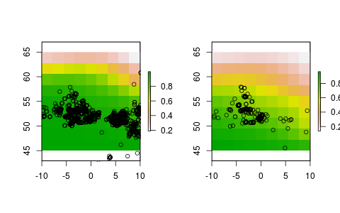

# Progress

## Lists

The whole of the week has been rewriting the main function (and many others) so that the package can accept lists of modules. This is now done and I think the package works sensibly. Here is some examples

Get the package from github.

    # install devtools
    install.packages('devtools')
    library('devtools')
    
    # install and load zoon from github
    install_github('zoonproject/zoon')
    library('zoon')

Then to run an analysis for two species we might can use the module 'SpOcc'. This collects data from a number of ecological databases using the 'spooc' package by ROpenSci. By default it uses just GBIF which is fine for our purposes.

    flow <- workflow(occurMod = list(
                       ModuleOptions('SpOcc', 
                         species = 'Culex pipiens', extent = c(-20,20,45,65)), 
                       ModuleOptions('SpOcc', 
                         species = 'Anopheles plumbeus', extent = c(-20,20,45,65)) 
                    ),
                    covarMod = 'UKAir',
                    procMod = 'OneHundredBackground',
                    modelMod = 'LogisticRegression',
                    outMod = 'SameTimePlaceMap')

This will give us two separate analysis, one for each species. The output modules are not particularly well set up for parallel output yet. But we can have a quick look at our output with

    par(mfrow=c(1,2))
    plot(flow$output[[1]])
    points(flow$occurrence[[1]][,1:2])
    plot(flow$output[[2]])
    points(flow$occurrence[[2]][,1:2])

So any of the modules can be given parallel modules in this fasion. But only one module can have multiple modules as it is unclear quite what would be wanted with multiple sets of modules and if it's all combinations then this will quickly get fairly ridiculous.

    x <- workflow(occurMod = list('UKAnophelesPlumbeus',
                    'UKAnophelesPlumbeus'),
           covarMod = list('UKAir', 'UKAir'),
           procMod = 'OneHundredBackground',
           modelMod = 'LogisticRegression',
           outMod = 'SameTimePlaceMap')

    Error in workflow(occurMod = list("UKAnophelesPlumbeus", "UKAnophelesPlumbeus"),  : 

# To do

## Daisy chain
Following on from the listable work above I really need to now write functions that 'daisy chain' modules together rather than running them in parallel. For example, as output we might want AUC and a map, but that shouldn't stop us running two species. Or we might want to use species data from two sources but want to combine them and run a number of models, rather comparing analyses done with the two datasets separately.

## Multicore
Something that I won't be doing immediately but might be quite easy and useful to implement is to make these analyses run on parallel cores. As the code is written with *apply functions, this should be fairly quite straight forward.

## Cross validation
This is probably what I will do next. The main functions need to be rewritten so that cross validation and external validation is an integral part of the workflow

## Documentation
It's not quite clear how to do the documentation for modules. As the modules are held on repositories, the documentation isn't loaded automatically with the package. Furthermore, we want it to be easy for contributors to add well documented modules. This will probably be done by making the MakeModule() function ask for information.

As a first attempt I think the documentation will be just written manually and held on the online repo. A new function will call the documentation given the module name.

